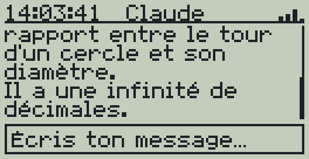
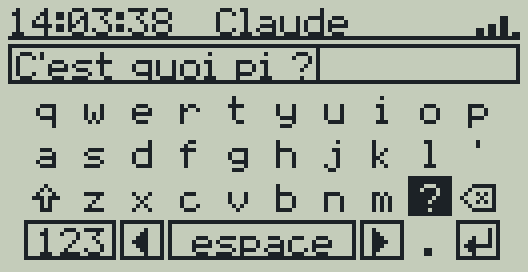

# L'app de la calculatrice

L'add-in **Claude** pour la Casio fx-9750GIII, écrit en C avec gint et le
fxSDK, sur la même base que les jeux Mines et Tetris (police avec accents,
boîtes de dialogue, simulateur).




## Utilisation

- En haut : **l'heure** (réglée par Internet via l'ESP32) et **la force du
  Wi-Fi** de l'ESP32 (4 barres ; une croix si l'ESP32 ne répond pas).
- Au milieu : la conversation, en style terminal (`> ta question`, puis la
  réponse de Claude). **▲ ▼** font défiler.
- **EXE** ouvre le **clavier visuel** QWERTY : on choisit les touches avec les
  flèches et on les tape avec EXE. La touche en bas à gauche change de page
  (`123` chiffres et symboles, `éà` accents, `abc` lettres), ⇧ met une
  majuscule (deux fois : verrouillage), ◀ ▶ déplacent le curseur, ⌫ efface,
  ↵ envoie. Raccourcis : SHIFT = majuscule, DEL = effacer, EXIT = fermer.
- **EXIT** ouvre le menu : nouvelle conversation, état de la connexion,
  aide, quitter.

## Organisation

| Fichier | Rôle |
| --- | --- |
| `src/app.c` | écrans : conversation, clavier, menu |
| `src/keyboard.c` | le clavier visuel (pages, navigation, dessin) |
| `src/chat.c` | la conversation et son découpage en lignes d'écran |
| `src/editor.c` | le texte en cours d'écriture et son curseur |
| `src/status.c` | la barre d'état (heure, Wi-Fi) |
| `src/protocol.c` | le dialogue avec l'ESP32 |
| `src/platform_gint.c`, `src/link.S` | la calculatrice : clavier, écran, **port série** |
| `sim/` | le simulateur PC et le faux ESP32 (`esp32_simule.py`) |
| `tests/` | les tests de la logique |

**Mémoire :** un add-in n'a que 6 Ko de mémoire statique sur la
calculatrice ; la conversation (6 Ko) et les réponses (3 Ko) sont donc
réservées sur le tas au démarrage.

**Port série :** gint ne pilote pas encore le port 3 broches. Pendant un
échange, `gint_world_switch()` rend la main au système de la calculatrice et
on utilise ses fonctions série (`Serial_Open`, `Serial_ReadOneByte`…, voir
`link.S`). L'écran reste figé pendant l'échange. **C'est la partie qui n'a
pas encore pu être essayée sur la vraie calculatrice.**

## Le protocole avec l'ESP32

Des lignes de texte UTF-8, à 9600 bauds (8 bits, sans parité, 1 bit de stop) :

| La calculatrice envoie | L'ESP32 répond |
| --- | --- |
| `PING` | `PONG <rssi> <heure>`, par exemple `PONG -63 14:03:27` (`-` si inconnu) |
| `Q <question>` | `ATT`, puis `R <ligne>` pour chaque ligne de la réponse, puis `FIN` ; ou `ERR <message>` |
| `NOUV` | `OK` (nouvelle conversation) ; ou `ERR <message>` |

L'app demande l'état (`PING`) toutes les 10 secondes.

## Compiler et tester

```sh
make check          # tests + parcours de tous les écrans + ressources à jour
make screenshots    # captures dans docs/images/
make assets         # après une modification de assets/*.txt
```

Le simulateur utilise un **faux ESP32** (`sim/esp32_simule.py`). Pour
discuter avec le **vrai Claude** depuis l'app simulée, lancer la mini-API
(`../mac/demarrer.sh`), puis :

```sh
make sim && SIM_ESP32=mac ./build/claude-sim -o build sim/essai.txt
```

L'add-in se compile avec le fxSDK (`fxsdk build-fx` ou l'image Docker, comme
pour les jeux) et produit `Claude.g1a`.
